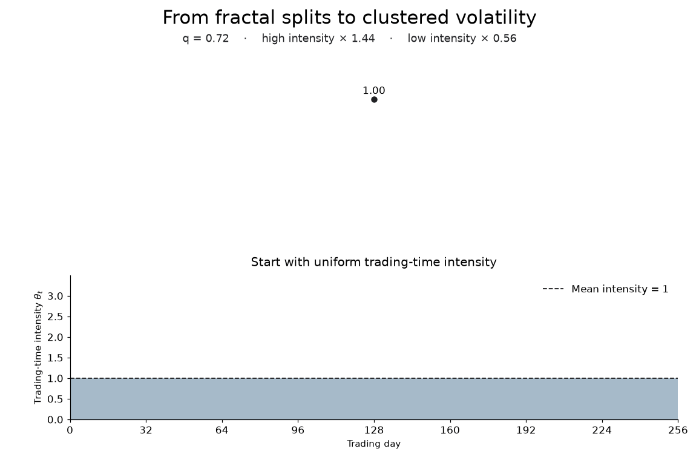
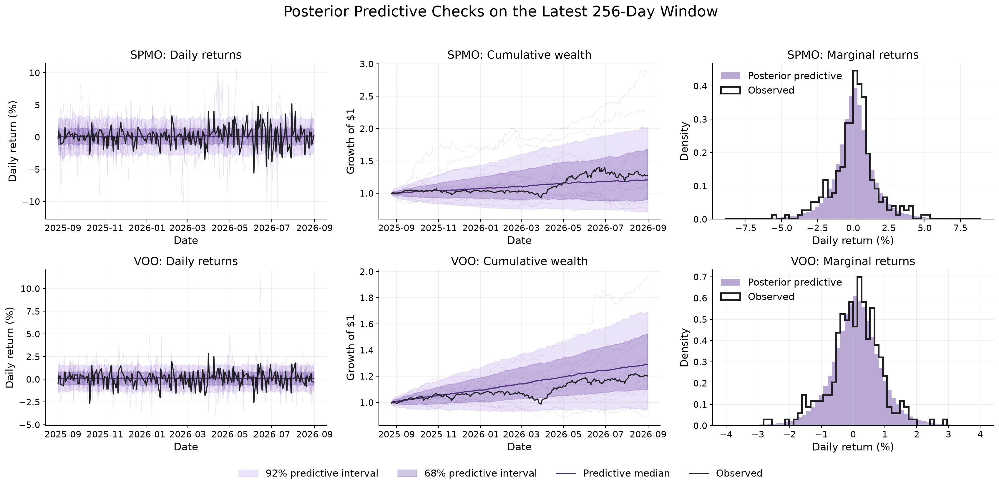
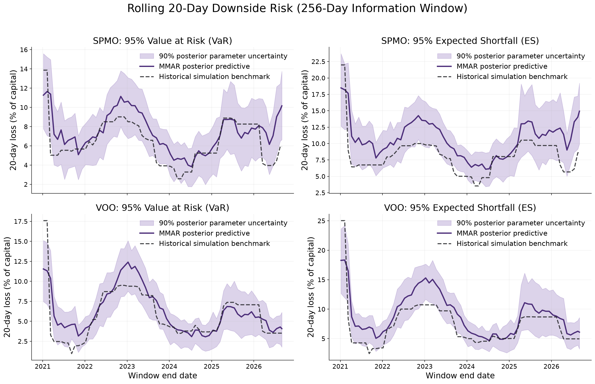

# Amortized fractals: fractal volatility and heavy-tailed returns

This demonstrates an end-to-end amortized Bayesian workflow for **Multifractal Models of Asset Returns (MMAR)**.
We will train neural posterior estimators on simulated markets, then reuse them across rolling $T$-day windows to estimate parameters, simulate wealth paths, and quantify downside risk from real market returns.

- [Univariate MMAR (SPMO / VOO)](mmar_univariate.ipynb)
- [Multivariate MMAR (VOO / GLD / TLT)](mmar_multivariate.ipynb)
- [Model-based stock screener](mmar_stock_screener.ipynb)
- [Volatility-cluster sensitivity (VOO / SPMO)](mmar_sensitivity.ipynb)

## From a cascade to market returns

A binomial fractial cascade splits intervals in half, then randomly assigns fractions $q$ and $1-q$ of its trading-time mass to the children: their **relative intensities** multiply by $2q$ and $2(1-q)$. Repeating this process creates clusters of quiet and turbulent days while preserving a mean intensity of one. The final weights are randomly shifted to avoid artifically placing cascade boundaries at the same positions in a $T$-day window.



The basic MMAR represents returns as:

$$
r_t = \mu + \bar\sigma\sqrt{\theta_t(q)}\,z_t,
\qquad z_t = \sqrt{\frac{\nu-2}{\nu}}\,\varepsilon_t,
\qquad \varepsilon_t \overset{\mathrm{iid}}{\sim} t_\nu.
$$

| Parameter | Controls |
| :--- | :--- |
| $\mu$ | Daily drift |
| $\bar\sigma$ | Baseline RMS return scale |
| $q$ | Cascade contrast and volatility clustering |
| $\nu>2$ | Innovation tail thickness |

All four parameters are fixed within a window. The shocks have unit variance before truncation; the random cascade makes returns **non-IID**.

### Three assets, one joint model

VOO, GLD and TLT each get their own drift, scale and cascade strength, with the same
prior ranges as the univariate model. Both workflows use eight 32-day cascade blocks.
The joint model shares split orientations, a random circular shift and one tail parameter $\nu$.
A **3 × 3 correlation matrix $R$**
describes how their innovation shocks move together: ones on the diagonal, pairwise
correlations off the diagonal.

$$
\mathbf r_t=\boldsymbol\mu+D_t\boldsymbol z_t,
\qquad D_t=\operatorname{diag}\!\left(\bar\sigma_i\sqrt{\theta_{i,t}}\right),
\qquad \boldsymbol z_t\sim t_\nu\!\left(\mathbf 0,\frac{\nu-2}{\nu}R\right).
$$

Here the second argument of $t_\nu$ is its **scale matrix**, not its covariance.
The factor $(\nu-2)/\nu$ gives each shock unit variance, so its covariance matrix equals
its correlation matrix $R$. The **return covariance**, conditional on the cascade and
parameters, is instead $\Sigma_t=D_tRD_t$ (before valid-path rejection).

The network estimates **13 parameters**: three drifts, three scales, three $q$ values,
one shared $\nu$, and these **three dependence parameters**:

| Parameter | Meaning |
| :--- | :--- |
| $a=\rho_{\mathrm{VOO,GLD}}$ | Stock–gold shock correlation |
| $b=\rho_{\mathrm{VOO,TLT}}$ | Stock–bond shock correlation |
| $c=\rho_{\mathrm{GLD,TLT}\mid\mathrm{VOO}}$ | Gold–bond partial correlation after removing their linear association with stock shocks |

All three lie in $(−1,1)$. The remaining pairwise correlation is
$\rho_{\mathrm{GLD,TLT}}=ab+c\sqrt{(1-a^2)(1-b^2)}$.
This reconstructs a positive-definite $R$ without learning duplicate matrix entries.

## Results preview

### Returns and cumulative wealth

Posterior resimulations versus observed SPMO and VOO returns, including growth of one dollar, $W_t=\prod_{s=1}^{t}(1+r_s)$. Shading shows **68% and 92% predictive intervals**.



### Rolling downside risk

**95% VaR** is the 95th percentile of predicted loss; **ES** averages the worst 5%.
The 20-day estimates use trailing 256-day windows, with historical simulation as a benchmark. The bands show **90% posterior-parameter variation**.



## Run the demo

Python **3.12–3.13**, from the repository root. Use a fresh environment to leave existing training dependencies untouched:

```bash
python -m venv .venv
source .venv/bin/activate
python -m pip install -e .
KERAS_BACKEND=torch jupyter lab
```

The three workflow notebooks define their workflows explicitly. **Run All trains** in those notebooks; stop before *Amortized inference* for prior checks only. The screener only loads a saved model. Market returns are cached in `data/`, and all figures are saved in `figures/`. Models and plotting/risk helpers live in [`mmar/`](mmar/).

Regenerate the animation with `python -m mmar.viz.cascade`.

### Stock screener

Run [`mmar_stock_screener.ipynb`](mmar_stock_screener.ipynb) from the repo root. It imports
BayesFlow before loading `checkpoints/univariate/model.keras`, then sends raw returns as
one `(stocks, 256, 1)` batch. Set the checkpoint path and round-trip cost at the top.
Downloads are cached in `data/screener/`; figures, the ranked table, exclusions and
predictive checks are saved in `figures/screener/`.

Stocks are ranked by **gain probability (%) / expected shortfall (%)** over 20 trading days.
Gain includes 0.20% round-trip costs; shortfall measures the average gross loss in the worst
5% of outcomes. A 70% gain probability with 10% shortfall gives a score of 7. Higher is better.
Fit flags compare observed return summaries with simulated ranges and remain visible beside
each rank. The 4-by-3 fit plot shows wealth, daily returns and maximum drawdown for the four
highest-ranked stocks, with observations in black. Simulations use current constituents and
fresh cascade phases.
