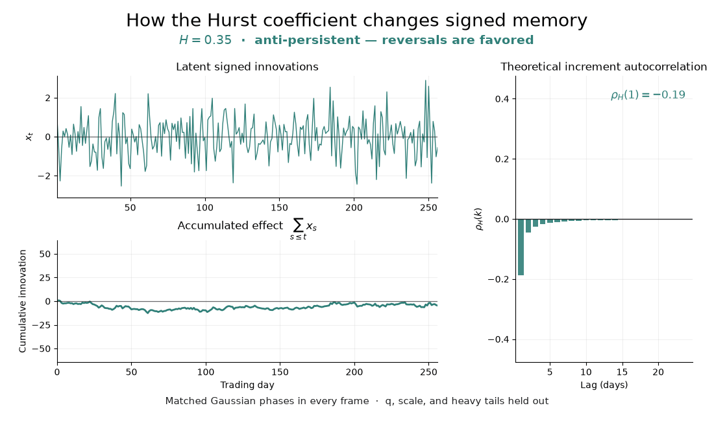

# Amortized fractals: fractal volatility and heavy-tailed returns

This repository demonstrates an end-to-end amortized Bayesian workflow for **Multifractal Models of Asset Returns (MMAR)**.
We train neural posterior estimators on simulated markets, reuse them across real markets, and propagate parameter uncertainty into wealth and downside risk.

The core narrative is:

1. [Univariate MMAR (SPMO / VOO)](mmar_univariate.ipynb)
2. [Model-based stock screener](mmar_stock_screener.ipynb)
3. [Multivariate MMAR (VOO / GLD / TLT)](mmar_multivariate.ipynb)
4. [Multivariate MMAR with Hurst memory](mmar_hurst.ipynb)

Supplementary analysis: [volatility-cluster sensitivity (VOO / SPMO)](mmar_sensitivity.ipynb).

## From a cascade to market returns

At the core of the model lies a **binomial fractal cascade**. The latter splits intervals in half, then randomly assigns fractions $q$ and $1-q$ of its trading-time mass to the children. Their **relative intensities** then multiply by $2q$ and $2(1-q)$. Repeating this process creates clusters of quiet and turbulent days. The final weights are randomly shifted to avoid artificially placing cascade boundaries at the same positions in a $T$-day window.


The basic MMAR represents returns as:

$$
r_t = \mu + \bar\sigma\sqrt{\theta_t(q)}\,\varepsilon_t,
\qquad \varepsilon_t=z_t\sqrt{\frac{\nu-2}{U_t}},
\qquad z_t\overset{\mathrm{iid}}{\sim}N(0,1),
\quad U_t\overset{\mathrm{iid}}{\sim}\chi^2_\nu,
\quad z_t\perp U_t.
$$

Thus $z_t$ is the Gaussian seed and $\varepsilon_t$ is the final standardized Student-$t$ innovation, with mean zero and variance one for $\nu>2$.

| Parameter | Controls |
| :--- | :--- |
| $\mu$ | Daily drift |
| $\bar\sigma$ | Baseline RMS return scale |
| $q$ | Cascade contrast and volatility clustering |
| $\nu>2$ | Innovation tail thickness |

All four parameters are stationary within a window. The shocks have unit variance before truncation; the random cascade makes returns **non-IID**.

### Going multivariate

In a multivariate analysis, VOO, GLD and TLT each get their own drift, scale and cascade strength, with the same prior ranges as the univariate model. Both workflows use eight 32-day cascade blocks.

The joint model shares split orientations, a random circular shift and one tail parameter $\nu$. A **3 × 3 correlation matrix $R$**
describes how their innovation shocks move together: ones on the diagonal, pairwise correlations off the diagonal.

$$
\mathbf r_t=\boldsymbol\mu+D_t\boldsymbol\varepsilon_t,
\qquad D_t=\mathrm{diag}\!\left(\bar\sigma_i\sqrt{\theta_{i,t}(q_i)}\right),
\qquad \mathbf z_t=L\mathbf g_t,
\quad \mathbf g_t\overset{\mathrm{iid}}{\sim}N_3(\mathbf0,I_3),
\quad LL^\top=R,
$$
$$
\boldsymbol\varepsilon_t=\mathbf z_t\sqrt{\frac{\nu-2}{U_t}},
\qquad U_t\overset{\mathrm{iid}}{\sim}\chi^2_\nu.
$$

Here $\mathbf g_t$ is an independent Gaussian seed, $\mathbf z_t$ is the correlated Gaussian driver, and $\boldsymbol\varepsilon_t$ is the final standardized multivariate Student-$t$ innovation. Equivalently,
$\boldsymbol\varepsilon_t\sim t_{\nu,3}(\mathbf0,(\nu-2)R/\nu)$, where the second argument is its **scale matrix**, not its covariance.
The **return covariance**, conditional on the cascade and
parameters, is instead $\Sigma_t=D_tRD_t$.

The network estimates **13 parameters**: three drifts, three scales, three $q$ values,
one shared $\nu$, and these **three dependence parameters**:

| Parameter | Meaning |
| :--- | :--- |
| $a=\rho_{\mathrm{VOO,GLD}}$ | Stock–gold shock correlation |
| $b=\rho_{\mathrm{VOO,TLT}}$ | Stock–bond shock correlation |
| $c=\rho_{\mathrm{GLD,TLT}\mid\mathrm{VOO}}$ | Gold–bond partial correlation after removing their linear association with stock shocks |

All three lie in $(−1,1)$. The remaining pairwise correlation is
$\rho_{\mathrm{GLD,TLT}}=ab+c\sqrt{(1-a^2)(1-b^2)}$.
This reconstructs a positive-definite $R$ without learning duplicate matrix entries.
The prior is placed on $R$ through a normalized Wishart draw; $(a,b,c)$ are
derived coordinates, not three independent uniform priors.

### Add signed memory with Hurst exponents

The final notebook changes only the Gaussian-driver stage:

$$
z_{i,1:T}^{(H_i)}
=\mathcal F_{H_i}\!\left[(L\mathbf g)_{i,1:2T}\right]_{1:T},
\qquad
\varepsilon_{i,t}=z_{i,t}^{(H_i)}\sqrt{\frac{\nu-2}{U_t}}.
$$

$H_i=0.5$ recovers a white Gaussian driver, $H_i>0.5$ gives persistence, and
$H_i<0.5$ gives anti-persistence. Thus $q_i$ controls unsigned volatility
intermittency while $H_i$ controls signed dependence; the cascade and Student-$t$
layers are otherwise unchanged. When the $H_i$ differ, $R$ is the Gaussian
coherence before filtering rather than the exact same-day return correlation.



## Results preview

### Returns and cumulative wealth

Posterior resimulations versus observed SPMO and VOO returns, including growth of one dollar, $W_t=\prod_{s=1}^{t}(1+r_s)$. Shading shows **68% and 92% predictive intervals**.


### Rolling downside risk

**95% VaR** is the 95th percentile of predicted loss; **ES** averages the worst 5%.
The 20-day estimates use trailing 256-day windows, with historical simulation as a benchmark. The bands show **90% posterior-parameter variation**.


## Run the demo

Python **3.12–3.13**, from the repository root. Use a fresh environment to leave existing training dependencies untouched:

```bash
python -m venv .venv
source .venv/bin/activate
python -m pip install -e .
KERAS_BACKEND=jax
```

The three modeling notebooks define their training workflows explicitly. The screener only loads the saved univariate model. Market returns are cached in `data/`, and all figures are saved in `figures/`. Models and plotting/risk helpers live in [`mmar/`](mmar/).

### Stock screener

The [screener demo](mmar_stock_screener.ipynb) applies the pretrained network to hundreds of assets and ranks them according to a custom score. Stocks are ranked by **gain probability (%) / expected shortfall (%)** over the next 20 trading days. Gain includes 0.20% round-trip costs; shortfall measures the average gross loss in the worst 5% of outcomes. 

For example, a 70% gain probability with 10% shortfall gives a score of 7. Higher is better. Fit flags compare observed return summaries with simulated ranges and remain visible beside each rank.
